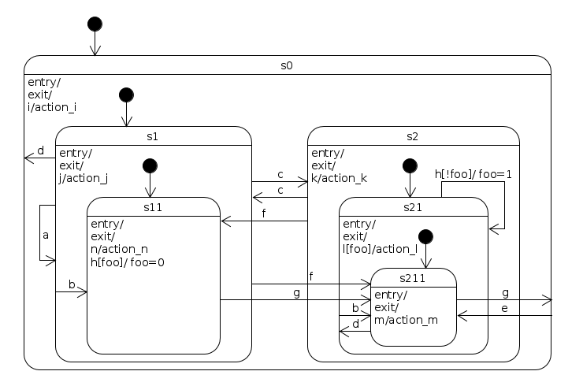
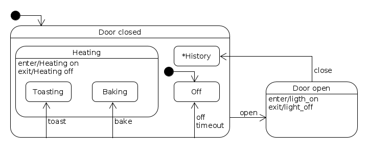

.. |State| replace:: :class:`~pysm.pysm.State`

Examples
========

.. contents::
    :local:

Simple state machine
--------------------

This is a simple state machine with only two states - `on` and `off`.

.. include:: ../examples/simple_on_off.py
    :literal:

Fluent builder
--------------

The optional builder module reduces setup boilerplate while still using the
same ``StateMachine``, ``State``, and ``Event`` classes at runtime.

.. code-block:: python

    from pysm import Event
    from pysm.builder import StateMachineBuilder

    machine = (StateMachineBuilder('toggle')
               .state('off', initial=True)
               .state('on')
               .transition('off', 'on', events='turn_on')
               .transition('on', 'off', events='turn_off')
               .build())

    machine.dispatch(Event('turn_on'))
    assert machine.leaf_state.name == 'on'

Nested machines can be addressed by path when short state names would be
ambiguous:

.. code-block:: python

    machine = (StateMachineBuilder('oven')
               .machine('door_closed', initial=True)
               .state('off', initial=True, parent_path='door_closed')
               .machine('heating', parent_path='door_closed')
               .state('baking', initial=True, parent_path='heating')
               .transition('off', 'baking', events='bake')
               .build())

Complex hierarchical state machine
----------------------------------

A Hierarchical state machine similar to the one from Miro Samek's book [#f1]_,
page 95. *It is a state machine that contains all possible state transition
topologies up to four levels of state nesting* [#f2]_

.. include:: ../examples/complex_hsm.py
    :literal:

Different ways to attach event handlers
---------------------------------------

A state machine and states may be created in many ways. The code below mixes
many styles to demonstrate it (In production code you'd rather keep your code
style consistent). One way is to subclass the |State| class and attach event
handlers to it. This resembles the State Pattern way of writing a state
machine. But handlers may live anywhere, really, and you can attach them
however you want. You're free to chose your own style of writing state machines
with pysm.
Also in this example a transition to a historical state is used.

.. include:: ../examples/oven.py
    :literal:

Reverse Polish notation calculator
----------------------------------

A state machine is used in the `Reverse Polish notation (RPN)
<https://en.wikipedia.org/wiki/Reverse_Polish_notation>`_ calculator as a
parser. A single event name (`parse`) is used along with specific `inputs` (See
:func:`pysm.pysm.StateMachine.add_transition`).

This example also demonstrates how to use the stack of a state machine, so it
behaves as a `Pushdown Automaton (PDA)
<https://en.wikipedia.org/wiki/Pushdown_automaton>`_

.. include:: ../examples/rpn_calculator.py
    :literal:

Queued dispatch
---------------

``QueuedStateMachine`` is useful when handlers may dispatch more events and
you want deterministic run-to-completion scheduling.

.. code-block:: python

    from pysm import Event, State
    from pysm.queued import QueuedStateMachine

    calls = []
    machine = QueuedStateMachine('m')
    a = State('a')
    b = State('b')

    def enter_b(state, event):
        calls.append('enter_b')
        machine.dispatch(Event('finish'))
        calls.append('enter_b_returned')

    b.handlers = {'enter': enter_b}
    machine.add_state(a, initial=True)
    machine.add_state(b)
    machine.add_transition(a, b, events=['go'])
    machine.add_transition(
        b, None, events=['finish'],
        action=lambda state, event: calls.append('finish'))
    machine.initialize()

    machine.dispatch(Event('go'))
    assert calls == ['enter_b', 'enter_b_returned', 'finish']

Async dispatch
--------------

``AsyncQueuedStateMachine`` awaits async handlers, conditions, and transition
callbacks while preserving the same callback order as the synchronous runtime.

.. code-block:: python

    from pysm import Event, State
    from pysm.aio import AsyncQueuedStateMachine

    async def main():
        machine = AsyncQueuedStateMachine('m')
        idle = State('idle')
        ready = State('ready')

        async def enter_ready(state, event):
            await machine.dispatch(Event('validate'))

        ready.handlers = {'enter': enter_ready}

        machine.add_state(idle, initial=True)
        machine.add_state(ready)
        machine.add_transition(idle, ready, events=['go'])
        machine.add_transition(ready, None, events=['validate'])
        machine.initialize()

        await machine.dispatch(Event('go'))
        assert machine.leaf_state is ready

Snapshot and restore
--------------------

The serialization helper stores active machine state as plain Python data.
Recreate the same graph, initialize it, and then restore the snapshot.

.. code-block:: python

    from pysm import Event
    from pysm.builder import StateMachineBuilder
    from pysm.serialization import restore, snapshot

    def build_toggle():
        return (StateMachineBuilder('toggle')
                .state('off', initial=True)
                .state('on')
                .transition('off', 'on', events='turn_on')
                .transition('on', 'off', events='turn_off')
                .build())

    machine = build_toggle()
    machine.dispatch(Event('turn_on'))
    data = snapshot(machine, metadata={'source': 'example'})

    restored = build_toggle()
    restore(restored, data)

    assert restored.leaf_state.name == 'on'

----

.. rubric:: Footnotes

.. [#f1] `Miro Samek, Practical Statecharts in C/C++, CMP Books 2002.
        <http://www.amazon.com/Practical-Statecharts-Quantum-Programming-
        Embedded/dp/1578201101/ref=asap_bc?ie=UTF8>`_
.. [#f2] http://www.embedded.com/print/4008251 (visited on 07.06.2016)
